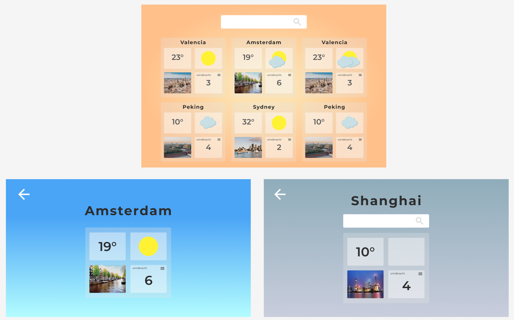
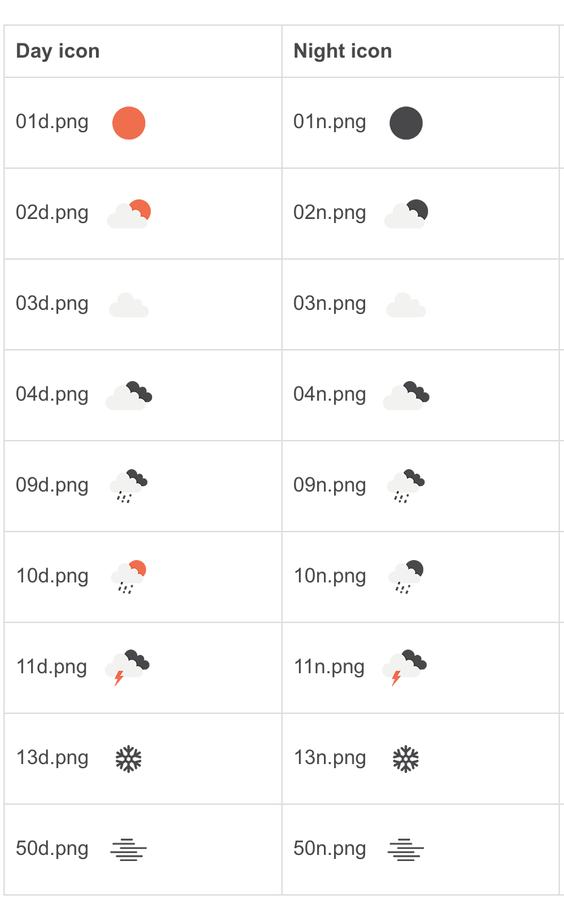
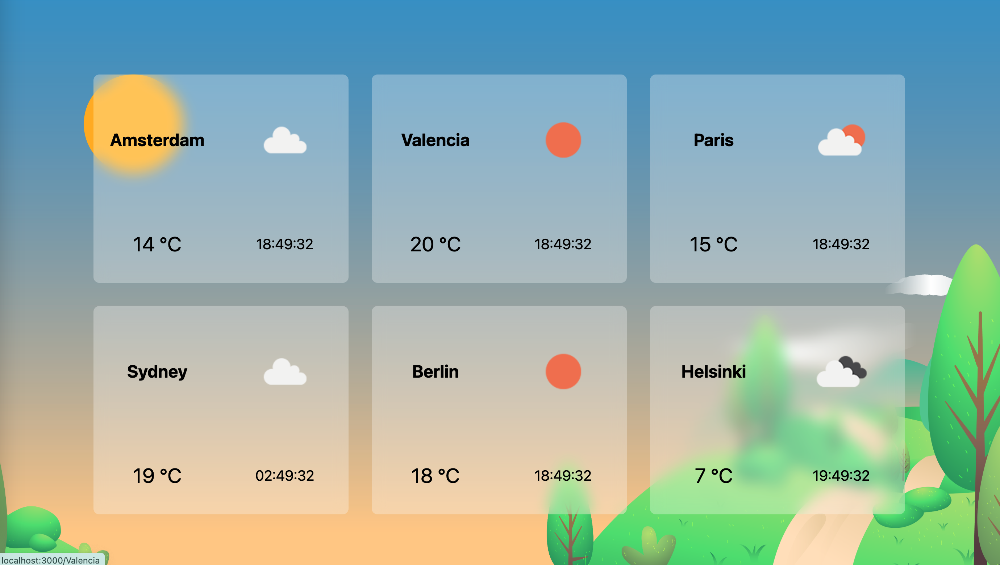
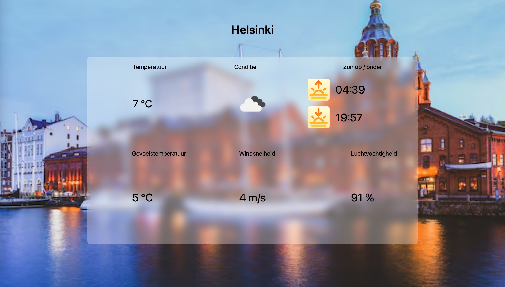

## **📚 Week 1**
Op de eerste dag kregen we uitleg over de basics van liquid en hoe je data kon ophalen. Na deze les vond ik het nog erg ingewikkeld, omdat bijna alles nieuw voor me is.

Mijn concept is oke, 2 api's en 1 web api combineren is voldoende. Als tip van Cyd kreeg ik: maak er een mooi design van!

Dit is de indeling in figma geworden waar ik voor nu aan vast houdt. 


Cyd vond het een prima concept waar ik mee door kon gaan, en vond het gaaf als ik 2 api's kon combninerern. Hier ga ik dus voor

## **💻 Week 2**
Nu was het tijd om aan de slag te gaan. Om eerlijk te zijn liep ik nog best wel veel vast aan het begin omdat ik gewoon niet wist waar ik moest beginnen. Het zijn een heleboel nieuwe dingen en ik zag eigenlijk door de bomen het bos niet meer. 

Op een gegeven moment trok ik aan de bel om te zeggen dat ik eigenlijk best wel vast liep. Toen vroeg Cyd dit aan de klas, en bijna de hele klas liep eigenlijk tegen hetzelfde probleem aan. Hierop kregen we van cyd een lesje voor 'noobs' om vanaf 0 weer te beginnen. Dit heeft mij geholpen, want hierna had ik het idee dat ik er wat van begon te snappen. Dit was eigenlijk het zetje in de rug wat ik nodig had. 

Nu begon ik met het inladen van de openweather api. Deze api geeft een heleboel info, hij heeft zelfs een eigen icon pack waarmee ik dus de weerconditie weer kan geven met een icon. 



Ook heb ik als plan om op mijn detailpagina een unsplash image api te linken, en te zorgen dat ik een afbeelding van de desbetreffende stad als achtergrond in stel. 

## **🧠 Week 3**
Deze week heb ik veel progressie kunnen maken. Ik heb mijn idee helder en ben dus flink gaan werken aan de styling van mijn weer-app.

Af en toe liep ik vast met data ophalen uit de api, maar dan vroeg ik Jamie om hulp en kwamen we er samen uit. Jamie heeft mij een hoop geleerd tijdens dit vak (en eigenlijk tijdens de hele minor). 

Ook ben ik deze week begonnen met het maken van de detailpagina. De bedoeling is om hier verschillende weerstats te laten zien. Ik heb voor mezelf de de volgende selectie gemaakt: 
- Temperatuur
- zon op / zon onder
- Weerconditie
- Gevoelstemperatuur
- Luchtvochtigheid
- Windsnelheid

Ook ben ik tot het besluit gekomen om over te schakelen van de unsplash api naar de freepik api, op aanraden van Jamie. Deze api zou iets makkelijker te linken zijn. Ik weet niet of dat klopt maar het is in ieder geval goed gelukt dus daar ben ik erg blij mee! 

In eerste instantie kreeg ik hele aparte afbeelding met een cartoon-achtige look. Dit kon ik fixen door het volgende toe te voegen aan mijn link: 

- filters[ai-generated][excluded]=1
- &filters[content_type][photo]=1

Zo kan je dus een bepaald soort foto's uitfilteren. Ik wilde ook nog zorgen dat er geen mensen in de foto's kwamen maar dat was niet gelukt, hij pakte toen alsnog weer iets van cartoon.

## **🎯 Week 4**

In deze laatste dag wilde ik nog 2 web-api's toevoegen. Ik dacht om view-transitions toe te voegen en *de visibilitychange api.* Deze api veranderd eigenlijk de titel van je pagina op verschillende momenten. De naam die bovenaan naast de favicon staat, veranderd bijvoorbeeld wanneer je van de pagina af gaat. 

Omdat ik met steden werk heb ik de titel, wanneer je van de pagina af gaat, veranderd naar: **De stad wacht op je**, en wanneer je dan weer op de pagina zit: **Welkom!**

De code ziet er als volgt uit: 

**VisibilityChange api**
 ```js 
document.addEventListener('visibilitychange', () => {
  if (document.hidden) {
    document.title = 'De stad wacht op je';
  } else {
    document.title = 'Welkom!';
  }
})
```

**VisibilityChange api** 
```js 
document.addEventListener('navigate', () => {
  if (!document.startViewTransition) {
    return
  } else {
    document.startViewTransition(() => {
      console.log('View transition started');
    })
  }
})
```
**VisibilityChange api CSS** 

```css
@view-transition {
  navigation: auto;
}
```

Als een kleine korte reflectie voor mezelf had ik wat meer kunnen doen met de web api's vanaf de start. Ik was eigenlijk zo verdwaald aan het begin dat ik hier niet aan gedacht heb en daarom heb ik ze pas in de laatste week toegevoegd. Ik merk dat dit juist wel iets is wat ik begrijp en daarom vind ik het jammer dat ik hier niet eerder mee ben begonnen. Aan de andere kant ben ik wel blij dat ik hier al iets over geleerd heb!





